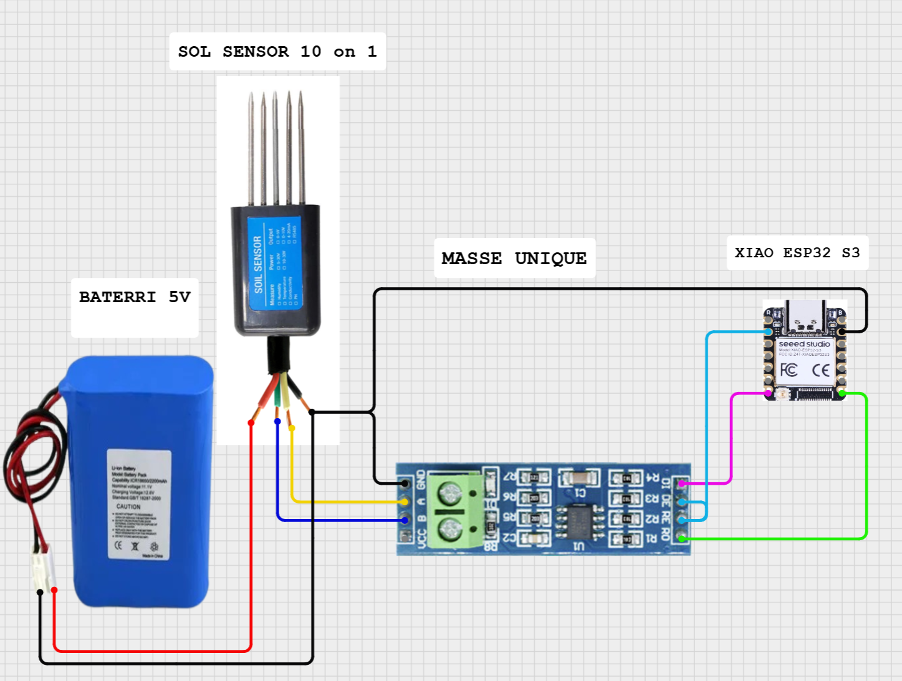

# TERRA-AI
TERRA AGRICOL




# 📦 GUIDE D'INSTALLATION - TerraSoil Library

## 🎯 Méthode 1 : Installation via fichier ZIP (RECOMMANDÉ)

### Étape 1 : Télécharger
Téléchargez le fichier **TerraSoil.zip**

### Étape 2 : Installer dans Arduino IDE
1. Ouvrir **Arduino IDE**
2. Menu : **Sketch** → **Include Library** → **Add .ZIP Library...**
3. Sélectionner le fichier **TerraSoil.zip**
4. Attendre le message : "Library added to your libraries"

### Étape 3 : Vérifier l'installation
1. Menu : **File** → **Examples** → **TerraSoil**
2. Vous devriez voir :
   - BasicReading
   - AdvancedReading

✅ **Installation terminée !**

---

## 🎯 Méthode 2 : Installation manuelle

### Localiser le dossier libraries

**Windows :**
```
C:\Users\[VotreNom]\Documents\Arduino\libraries\
```

**Mac :**
```
/Users/[VotreNom]/Documents/Arduino/libraries/
```

**Linux :**
```
/home/[VotreNom]/Arduino/libraries/
```

### Installation
1. Extraire le dossier **TerraSoil** de l'archive
2. Copier le dossier complet dans le répertoire `libraries`
3. Redémarrer Arduino IDE

### Structure attendue
```
Arduino/
└── libraries/
    └── TerraSoil/
        ├── src/
        │   ├── TerraSoil.h
        │   └── TerraSoil.cpp
        ├── examples/
        │   ├── BasicReading/
        │   └── AdvancedReading/
        ├── library.properties
        ├── keywords.txt
        └── README.md
```

---

## 🚀 Premier test

### 1. Ouvrir l'exemple
**File** → **Examples** → **TerraSoil** → **BasicReading**

### 2. Configurer les pins
Vérifier que les pins correspondent à votre câblage :
```cpp
#define RS485_RX_PIN   44  // D7 sur XIAO ESP32-S3
#define RS485_TX_PIN   43  // D6 sur XIAO ESP32-S3
#define RS485_RTS_PIN  1   // D1 sur XIAO ESP32-S3
```

### 3. Compiler et téléverser
1. Sélectionner la carte : **XIAO ESP32S3**
2. Sélectionner le port COM
3. Cliquer sur **Upload** (➜)

### 4. Vérifier la sortie
Ouvrir le **Serial Monitor** (115200 baud)

**Sortie attendue :**
```json
{"hum":65.8,"temp":25.3,"ec":1250,"ph":6.5,"n":85,"p":42,"k":120,"sal":15,"tds":625,"fert":247,"ok":1,"time":5000}
```

---

## 🔧 Utilisation dans votre code

### Code minimal
```cpp
#include <TerraSoil.h>

#define RS485_RX_PIN   44
#define RS485_TX_PIN   43
#define RS485_RTS_PIN  1

HardwareSerial RS485Serial(1);
TerraSoil sensor(&RS485Serial, RS485_RTS_PIN);
TerraSoilData data;

void setup() {
  Serial.begin(115200);
  sensor.begin(RS485_RX_PIN, RS485_TX_PIN, 4800);
}

void loop() {
  if (sensor.readSensor(data)) {
    Serial.printf("Hum: %.1f%% | Temp: %.1f°C | pH: %.1f\n",
                  data.moisture, data.temperature, data.ph);
  }
  delay(5000);
}
```

---

## 📚 Fonctions disponibles

### 🔷 Initialisation
```cpp
sensor.begin(rxPin, txPin, baudRate)
```

### 🔷 Lecture complète (PRINCIPALE)
```cpp
sensor.readSensor(data)
```
Lit les **10 paramètres** en une seule fonction !

### 🔷 Configuration
```cpp
sensor.setReadDelay(50);     // Délai entre lectures (ms)
sensor.setTimeout(300);      // Timeout communication (ms)
uint8_t addr = sensor.getAddress();  // Adresse Modbus
```

### 🔷 Lecture individuelle
```cpp
uint16_t value;
sensor.readRegister(TERRASOIL_REG_MOISTURE, value);
```

---

## 📊 Structure de données

```cpp
TerraSoilData data;

// Après sensor.readSensor(data) :
data.moisture      // float    - Humidité (%)
data.temperature   // float    - Température (°C)
data.conductivity  // uint16_t - Conductivité (µS/cm)
data.ph            // float    - pH
data.nitrogen      // uint16_t - Azote (mg/kg)
data.phosphorus    // uint16_t - Phosphore (mg/kg)
data.potassium     // uint16_t - Potassium (mg/kg)
data.salinity      // uint16_t - Salinité
data.tds           // uint16_t - TDS (mg/L)
data.fertility     // uint16_t - Fertilité (mg/kg)
data.success       // bool     - true si succès
data.timestamp     // uint32_t - Timestamp (ms)
```

---

## ❓ Dépannage

### ❌ Erreur "TerraSoil.h: No such file"
**Solution :** La bibliothèque n'est pas installée correctement
- Vérifier le dossier libraries
- Redémarrer Arduino IDE

### ❌ Erreur "readSensor was not declared"
**Solution :** Le fichier n'inclut pas la bibliothèque
```cpp
#include <TerraSoil.h>  // Ajouter cette ligne
```

### ❌ Pas de données (timeout)
**Solution :**
1. Vérifier connexions RS485 (A vers A, B vers B)
2. Vérifier alimentation 5V du capteur
3. Vérifier que DE et RE sont reliés ensemble

### ❌ Données incorrectes
**Solution :**
1. Vérifier la masse commune (tous les GND reliés)
2. Vérifier l'adresse Modbus (défaut 0x01)
3. Vérifier le baudrate (4800)

---

## 🔗 Exemples d'utilisation

### Exemple 1 : Sortie JSON
```cpp
if (sensor.readSensor(data)) {
  StaticJsonDocument<256> doc;
  doc["hum"] = data.moisture;
  doc["temp"] = data.temperature;
  doc["ph"] = data.ph;
  serializeJson(doc, Serial);
}
```

### Exemple 2 : MQTT
```cpp
if (sensor.readSensor(data)) {
  String payload = String("{\"hum\":") + data.moisture + 
                   ",\"temp\":" + data.temperature + "}";
  client.publish("soil/data", payload.c_str());
}
```

### Exemple 3 : Seuil d'alerte
```cpp
if (sensor.readSensor(data)) {
  if (data.moisture < 30.0) {
    Serial.println("⚠️ ALERTE : Sol trop sec !");
  }
  if (data.ph < 6.0 || data.ph > 7.5) {
    Serial.println("⚠️ ALERTE : pH hors norme !");
  }
}
```

---

## 📖 Documentation complète

Consultez le fichier **README.md** dans le dossier de la bibliothèque pour :
- API complète
- Registres Modbus
- Schémas de câblage détaillés
- Plus d'exemples

---

## ✅ Checklist installation

- [ ] Fichier TerraSoil.zip téléchargé
- [ ] Bibliothèque ajoutée via Arduino IDE
- [ ] Exemples visibles dans le menu File → Examples
- [ ] Code compile sans erreur
- [ ] Câblage RS485 vérifié (A, B, DE/RE, alimentation)
- [ ] Masse commune connectée
- [ ] Premier test réussi avec BasicReading

---

**🌱 Bibliothèque installée ! Profitez de TerraSoil ! 🌱**
